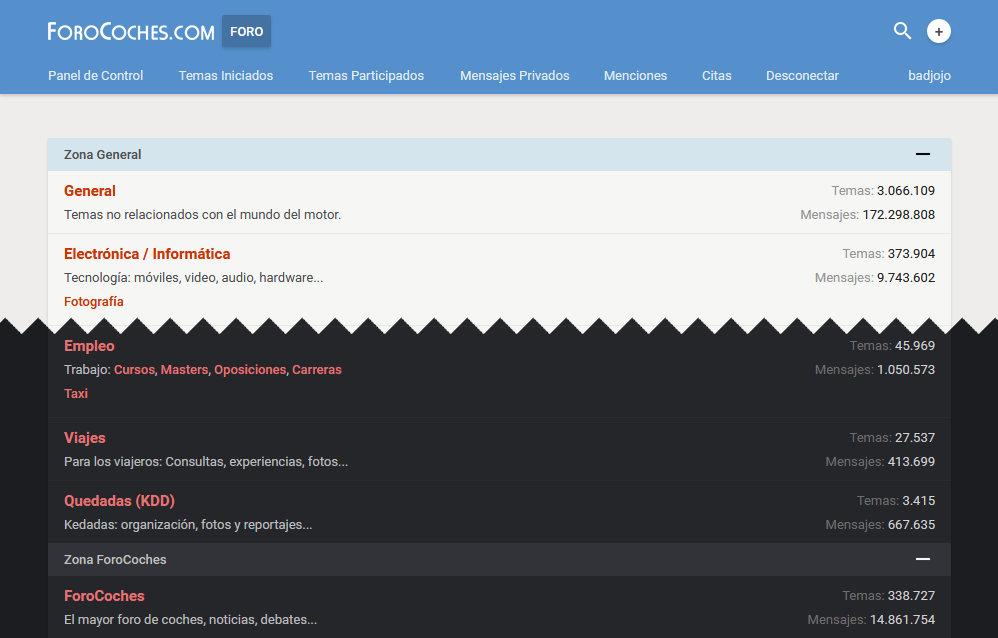
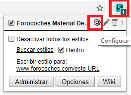
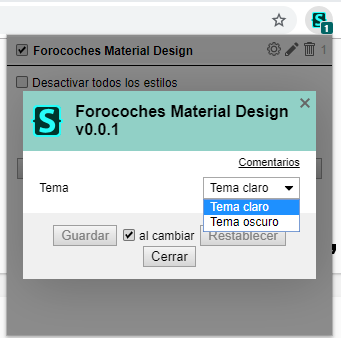

# Forocoches Material Design

Debido a algunos cambios en userstyles y para que no se vuelva a perder el tema, ahora se instalará directamente desde GitHub.

Gracias a @badjojo y [PDP Devs](https://github.com/pdp-devs) por crearlo.

## Vista previa

## Contribuir

Para contribuir, clonar el repo. Crear una nueva issue o escoger una issue a corregir. Crear una nueva rama DESDE LA RAMA release, con nombre issue/### siendo ### el número de la issue. Una vez acabado, subir el código a tu rama issue/### y hacer una PR desde issue/### hacia release.

## Instalación

Instala [Stylus](https://add0n.com/stylus.html) para [Firefox](https://addons.mozilla.org/en-US/firefox/addon/styl-us/), [Chrome](https://chrome.google.com/webstore/detail/stylus/clngdbkpkpeebahjckkjfobafhncgmne) u [Opera](https://addons.opera.com/en-gb/extensions/details/stylus/) o [Cascadea para Safari](https://cascadea.app/) y instala el tema desde:

📦 [Instalar via UserCSS](https://raw.githubusercontent.com/Nisgrak/fc-material-design/master/fc-material.user.css). Este formato soporta personalización y se actualiza automáticamente.  

## Personalización

Para cambiar los ajustes del tema es muy sencillo:

1- Hacer click en el icono de Stylus y después en la tuerca de configuración 

2- Escoger el tema que queremos utilizar 

